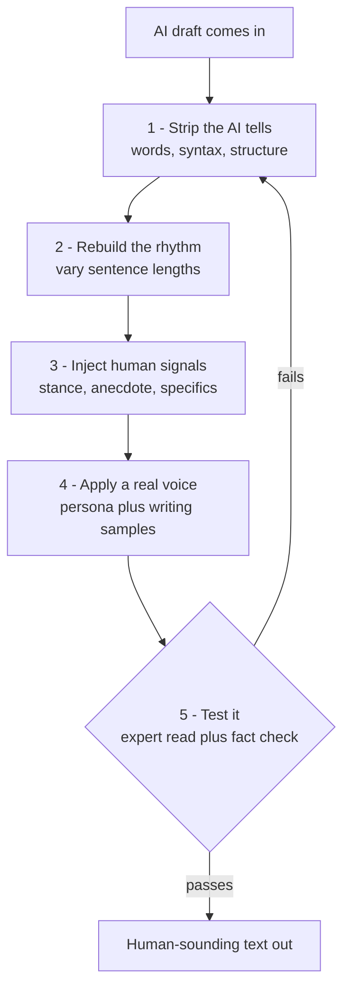

# The Humanization Pipeline (flowchart)

Plain-text and mermaid versions of the same pipeline shown as a visual in chat. This is the spine of the app: what has to happen to a piece of AI text, in order, for it to read as human.

## Plain-text version

```
        AI DRAFT COMES IN
                |
                v
  [1] STRIP THE AI TELLS            <- remove focal words, nominalizations,
                |                       participial-clause habits, rule-of-three,
                |                       "not X but Y", over-signposting, em-dash pile-ups
                v
  [2] REBUILD THE RHYTHM            <- force sentence-length variance (burstiness),
                |                       shorter constituents, allow fragments,
                |                       break the uniform-register habit
                v
  [3] INJECT HUMAN SIGNALS          <- hedges + opinion + first-person stance,
                |                       one concrete anecdote, named specifics
                |                       (tools/prices/dates), a real position taken
                v
  [4] APPLY A REAL VOICE            <- one coherent persona with a stable idiolect,
                |                       built from few-shot writing samples +
                |                       function-word profile (retrieval > light fine-tune)
                v
  [5] TEST IT                       <- expert-style read + meaning/fact check +
                |   \                   AI-vocab grep. Optional detector pass
                |    \
                |     '--- FAILS ---> back to [1]
                v
     HUMAN-SOUNDING TEXT OUT
```

## Why this order (evidence)

- Strip first because AI vocabulary is the #1 cue expert readers use (Russell et al. 2025) and focal-word inflation is the strongest corpus-proven signal (Kobak; Juzek & Ward).
- Rhythm second because burstiness is a distribution-level property; you rebuild it after the words are clean (Munoz-Ortiz).
- Human signals third: hedging, stance, first-person, specifics are what human prose has and AI suppresses (Jiang & Hyland; Herbold; Opara).
- Voice fourth and last-substantive because the persona has to be applied to already-clean, already-human-shaped text; a coherent persona is the single biggest lever for human judges (Jones & Bergen: 36% to 73%), and it must be built from real samples, not invented quirks (Grieve; TinyStyler; LaMP).
- Test and loop because naive one-pass humanizing leaves residual signal that experts and adversarial detectors catch (DAMAGE; Russell), and every extra pass risks meaning and facts (Sadasivan; the trade-off law). Minimum passes to clear the target bar.

## Mermaid version



## The bar to clear (pick per use case)

- General audience: lay readers are already at ~50% (coin flip). Stages 1-3 are plenty.
- Expert reader or adversarial detector: you need genuine restructuring plus a real voice (all 5 stages, looped), because paraphrase alone leaves the vocabulary and structure cues that experts catch.
- Never trade truth for evasion. Stage 5's fact check is non-negotiable given the trade-off law.
